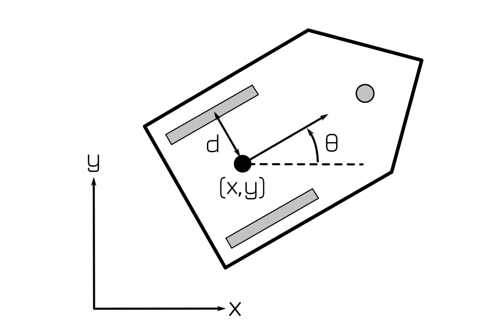
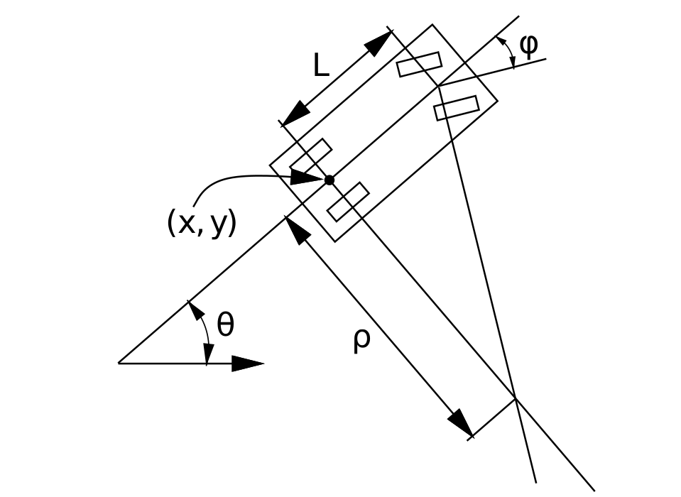
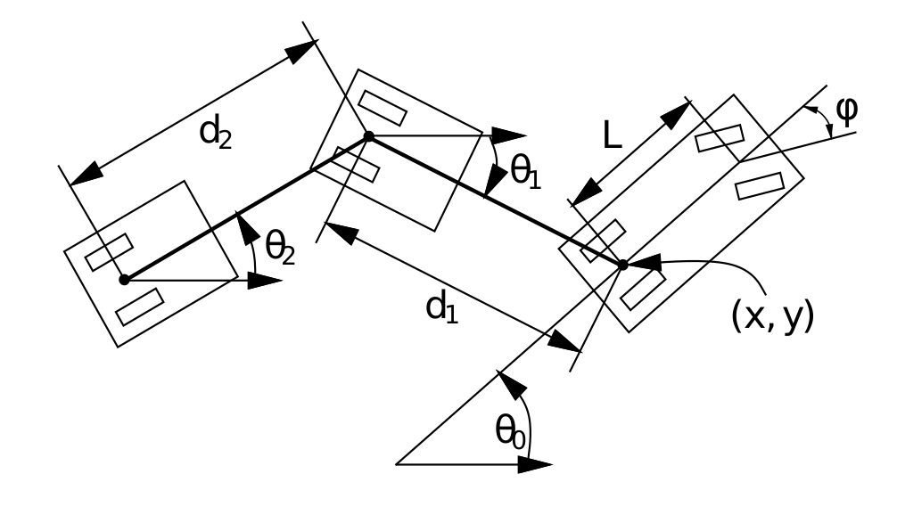

# Motion_Planning_for_Autonomous_Parking

## The Parking Problem
A common path planning problem for autonomous vehicles involves maneuvering in tight spaces and cluttered environments, particularly while parking. To address these issues, non-holonomic constraints of the vehicles must be taken into consideration. At the same time, collision checking algorithm must also be deployed to make sure the vehicle path is collision-free. Considering the above constraints, this project implements path planning for the following types of vehicles:
* A DiWheel Robot
* A car with Akerman Steering
* A car pulling Trailer

## About the environment
The project is implemented using the pygame library of python. The environment for the same is a parking lot in a two dimensional grid world. In each instance, a car starts at the Northwest corner of the bounded two dimensional field. The car is to be parked in a compact space in the southern border, flanked by vehicles both in front of and behind the target space. Additionally, there is an island in the central region. The environment approximately looks like the following:

## DiWheel Kinematics

https://user-images.githubusercontent.com/53962958/143936200-ef45402e-b3e2-4845-86d1-c1ec8888e690.mp4

## Akerman Steering

https://user-images.githubusercontent.com/53962958/143936309-f0bab79c-d6de-453b-85d6-061fe1ccf806.mp4

## A Car pulling Trailer

https://user-images.githubusercontent.com/53962958/143936321-e9bff339-687a-46f1-929c-8718e4d58e88.mp4

